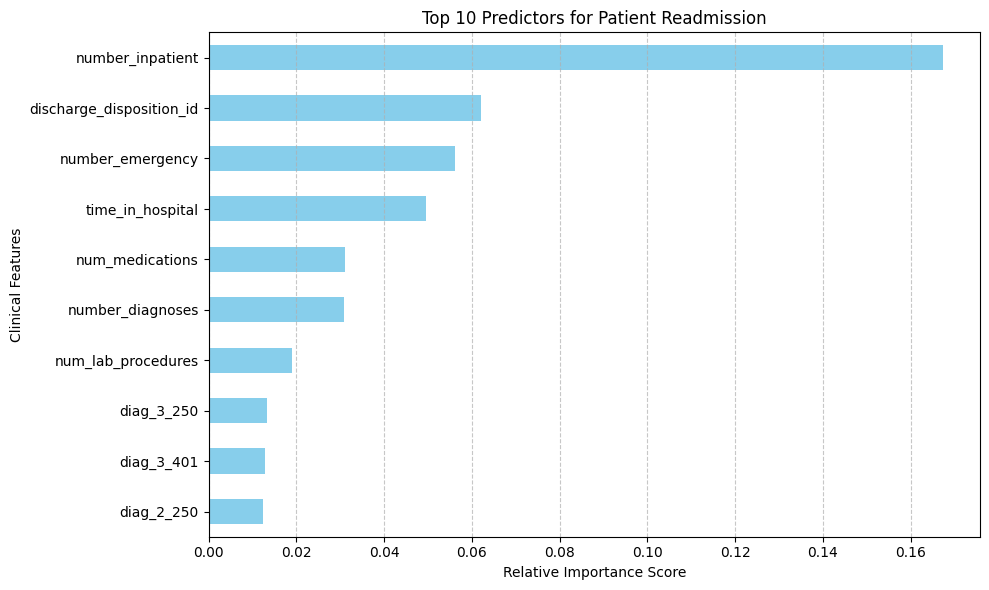
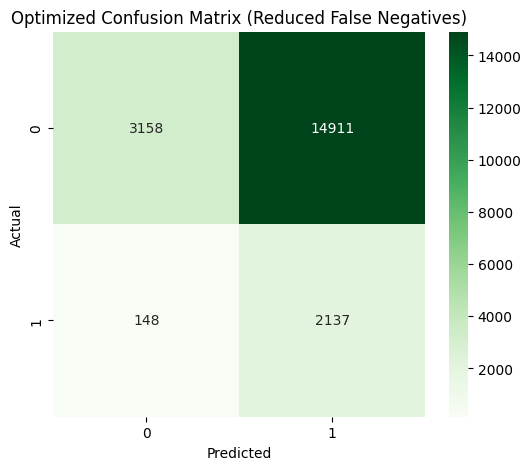

# Diabetic Readmission Prediction Model

## 🩺 Project Overview
This project focuses on predicting hospital readmission rates for diabetic patients within 30 days of discharge. Using the Diabetes 130-US hospitals dataset from the UCI Machine Learning Repository, I developed a machine learning pipeline specifically optimized for clinical safety and decision-making.

## 🎯 The Goal
The primary objective is to build a screening tool that flags high-risk individuals before they are discharged. This allows care teams to implement proactive clinical interventions, arrange better transitional care, and safely reduce preventable hospital readmission costs.

## 🛠 Tech Stack
* **Language:** Python
* **Libraries:** Pandas, NumPy, Scikit-Learn, Matplotlib, Seaborn
* **Model:** Random Forest Classifier
* **Key Techniques:** Handling severe class imbalance via `class_weight='balanced_subsample'`, and custom probability thresholding to prioritize patient risk detection.

## 📊 Key Findings
- **Top Clinical Predictors:** The absolute strongest indicator of a patient being readmitted is their healthcare utilization history—specifically the **Number of Inpatient Visits** in the past year, followed by **Discharge Disposition** and **Number of Emergency Visits**.
- **Clinical Optimization:** In healthcare analytics, a False Negative (missing a patient who needs help) is far more dangerous than a False Alarm. By shifting the decision threshold to **0.45**, I optimized the model's clinical sensitivity. This adjustment successfully caught **94% of all readmissions**, dropping missed high-risk cases from 983 down to just 148.

## 📈 Visualizations

### 1. Driving Factors of Readmission
The Random Forest feature importance scores highlight that clinical history and discharge destination are vital for assessing risk:

### 2. Standard vs. Optimized Clinical Safety
By shifting the prediction threshold, the model minimizes missed high-risk cases, drastically improving screening reliability:

## 💡 Why This Matters
As a healthcare professional, I am passionate about bridging the gap between clinical workflows and data science. This project proves how standard machine learning metrics can be translated into real-world clinical strategies—sacrificing general accuracy to maximize patient safety and ensure vulnerable individuals receive the transitional care they need.
